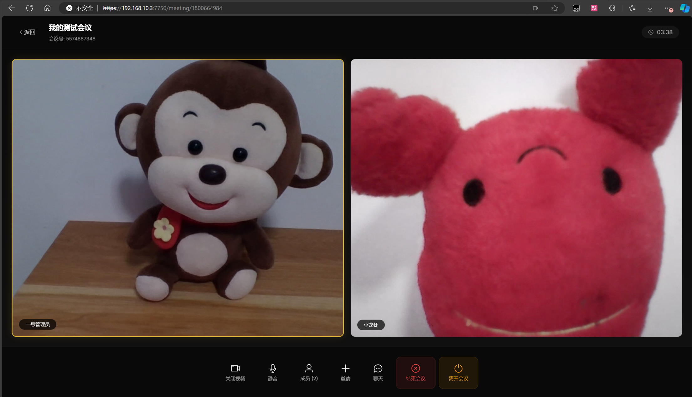
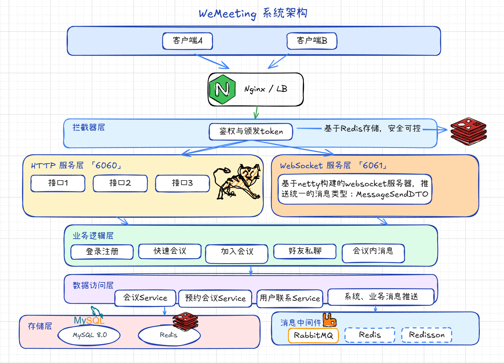
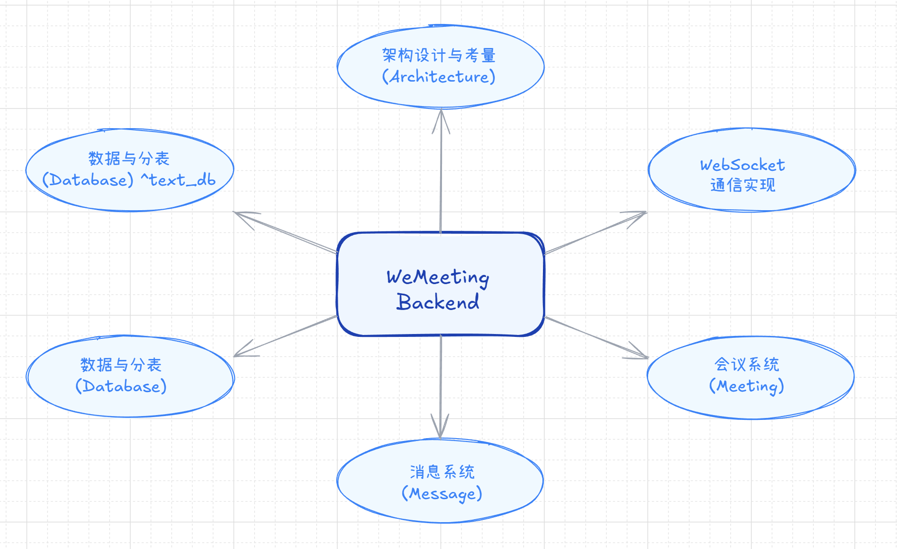
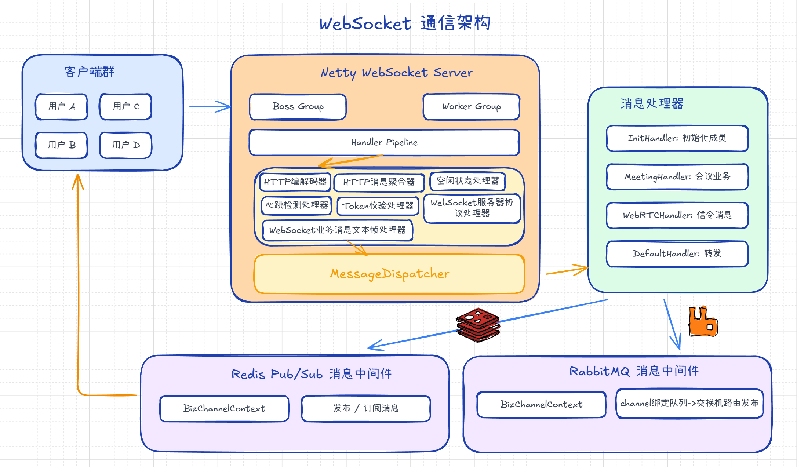
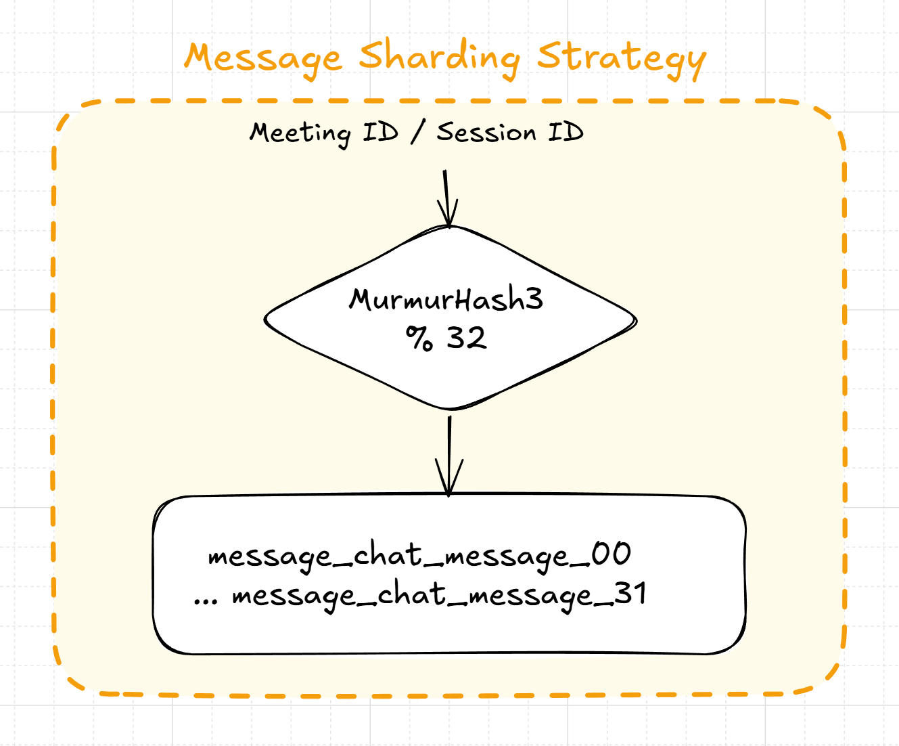
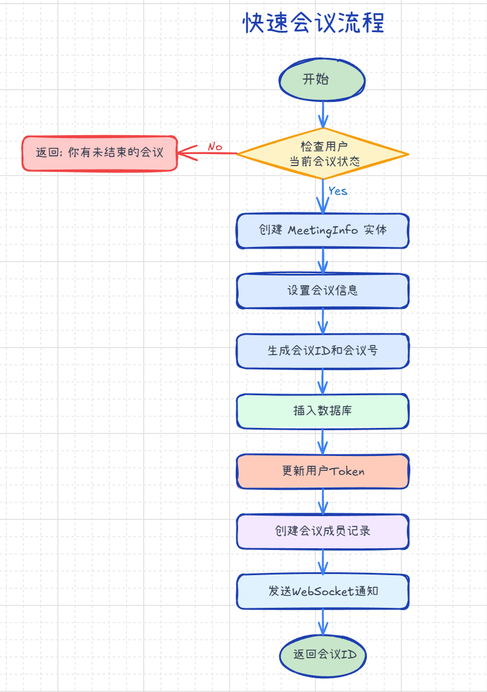

# WeMeeting

WeMeeting 是一个高性能、可扩展的视频会议系统后端，基于 **Spring Boot 3** 和 **Netty** 构建。它提供了强大的实时通信能力，支持 WebRTC 信令转发，并具备灵活的消息广播架构，能够轻松适应单机或集群部署环境。

## 目录

- [核心特性](#核心特性)
- [演示截图](#演示截图)
- [系统架构](#系统架构)
- [技术栈](#技术栈)
- [消息广播机制](#消息广播机制)
- [消息分表策略](#消息分表策略)
- [业务流程](#业务流程)
- [快速开始](#快速开始)
- [如何编辑架构图](#如何编辑架构图)

## 核心特性

- **高性能 WebSocket 服务**: 基于 Netty 构建，支持高并发连接，自定义文本协议，心跳保活。
- **灵活的消息广播架构**: 支持 **Local** (单机)、**Redis Pub/Sub** (轻量集群)、**RabbitMQ** (高可靠集群) 三种模式，适应不同规模部署。
- **海量消息存储方案**: 采用 **MurmurHash3** 算法实现**水平分表**策略，有效应对高频聊天数据的存储压力。
- **全功能会议管理**: 支持**快速会议**与**预约会议**，提供会议成员管理、踢人拉黑、状态同步、WebRTC 信令转发等核心能力。
- **多维即时通讯**: 集成**会议内群聊**与**会议外好友私聊**，支持离线消息、未读计数及历史记录。

## 演示截图



## 系统架构

WeMeeting 采用分层架构设计，Netty 负责接入层的高并发连接，Spring Boot 负责业务逻辑处理。



### 后端模块划分

后端主要划分为以下核心模块：



## 技术栈

| 分类 | 技术/库 | 说明 | 版本 |
| :--- | :--- | :--- | :--- |
| **开发语言** | Java | 核心编程语言 | 21 |
| **核心框架** | Spring Boot | 基础 Web 框架 | 3.4.0 |
| **网络通信** | Netty | 高性能 NIO 框架，提供 WebSocket 支持 | 4.1.104.Final |
| **数据库** | MySQL | 关系型数据库 | 8.0.33 |
| **ORM 框架** | MyBatis | 持久层框架 (spring-boot-starter) | 3.0.3 |
| **缓存中间件** | Redis (Redisson) | 分布式缓存、分布式锁、Pub/Sub | 3.26.0 (Starter) |
| **消息中间件** | RabbitMQ | 消息广播 (spring-boot-starter-amqp) | Default |
| **身份认证** | JWT (jjwt) | JSON Web Token 认证 | 0.12.3 |
| **JSON 处理** | FastJSON2 | 高性能 JSON 序列化/反序列化 | 2.0.60 |
| **工具库** | Apache Commons | Lang3, Codec, IO | 3.14.0 / 1.16.0 |
| **验证码** | Easy Captcha | 验证码生成 | 1.6.2 |
| **JS 引擎** | Nashorn | 用于执行 Captcha 的算术运算 | 15.4 |
| **开发工具** | Lombok | 简化 Java 代码 | 1.18.30 |
| **日志** | Logback | 日志框架 | 1.5.12 |

## 消息广播机制

为了支持集群部署，并考虑到项目的规模和预期，项目设计使用：基于 **“广播 + 本地过滤”** 的消息分发模型。



通过 `MessageHandler` 接口抽象了消息分发逻辑，并提供了三种实现策略：

1.  **Local 模式** (`messaging.handle.channel=local`)：
    -   适用于单机部署。
    -   消息直接在本地内存中查找 Channel 并发送。
2.  **Redis 模式** (`messaging.handle.channel=redis`)：
    -   利用 Redis 的 Pub/Sub 机制。
    -   消息发布到 Topic，所有订阅该 Topic 的服务器实例都会收到消息，然后各自在本地查找目标用户进行推送。
3.  **RabbitMQ 模式** (`messaging.handle.channel=rabbitmq`)：
    -   利用 RabbitMQ 的 **Fanout Exchange** 和 **Anonymous Queue**。
    -   每台服务器启动时创建一个临时的、独占的匿名队列绑定到广播交换机，确保每台服务器都能收到全量消息。

**配置示例 (`application.yml`)**:

```yaml
messaging:
  handle:
    # 可选值: local, redis, rabbitmq
    channel: rabbitmq

# 如果选择 rabbitmq，需配置：
spring:
  rabbitmq:
    host: localhost
    port: 5672
```

## 消息分表策略

为了应对海量消息存储带来的性能挑战，系统采用了水平分表策略，将消息数据均匀分散到多个**子表**中。



### 核心设计
- **算法**: 使用 `MurmurHash3` 算法保证数据分布的均匀性。
- **分表数**: 默认为 **32** 张子表 (可配置)。
- **路由规则**:
  - **会议内消息**: 根据 `meeting_id` 进行哈希取模。
    - 表名: `message_chat_message_{01-32}`
  - **会议外私聊消息**: 根据 `session_id` (双方 UserID 字典序拼接，中间使用 `_` 分隔) 进行哈希取模，确保同一会话的消息落入同一张表。
     - 表名: `private_chat_message_{01-32}`

## 业务流程

### 快速会议流程

用户发起快速会议的典型交互流程如下：



## 快速开始

### 前置要求

- JDK 21+
- MySQL 8.0+
- Redis
- RabbitMQ (可选，如果使用 RabbitMQ 模式)

### 部署步骤

1.  **克隆项目**
    
    ```bash
    git clone https://github.com/Nahiyi/we-meeting.git
    ```
    
2.  **初始化数据库**
    
    - 创建数据库 `easymeeting`。
    - 导入 SQL 脚本。
    
3.  **修改配置**
    
    - 打开 `src/main/resources/application.yml`。
    - 配置数据库连接、Redis 地址。
    - 根据需要选择 `messaging.handle.channel`。
    
4.  **运行服务**
    
    - 运行 `EasymeetingApplication.java`。
    - 服务默认启动在 `6060` (Web) 和 `6061` (WebSocket) 端口。

---

## 如何编辑架构图

🎈本项目文档中的架构图均使用 **Excalidraw** 绘制，源码保存在 `assets/excalidraw` 目录下。如果你需要修改或复用这些图表，请按照以下步骤操作：

1.  找到 `assets/excalidraw` 目录下对应的 `.json` 文件（例如 `WeMeeting系统架构.json`）。
2.  用文本编辑器打开该文件，**复制全部`json`内容**。
3.  在浏览器中打开 [https://excalidraw.com/](https://excalidraw.com/)。
4.  直接在页面上 **Ctrl+V (粘贴)**。
5.  此时图表将加载到画布中，你可以自由编辑并导出新的图片啦！
