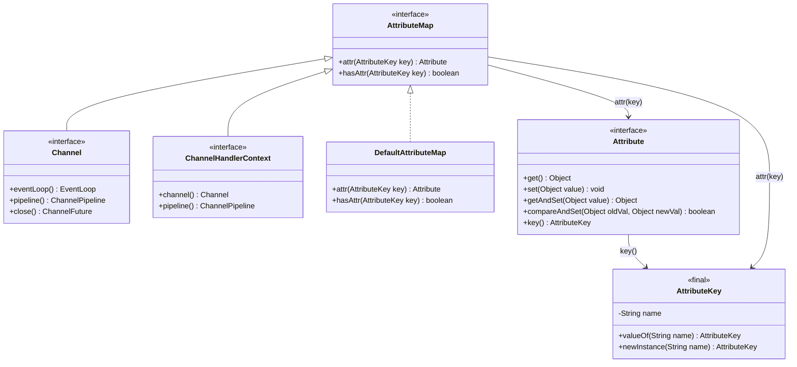

# Netty Channel 属性（Attribute）绑定 核心笔记

## 一、核心类关系（类图）



### 类关系核心解读
1. **AttributeMap（属性映射接口）**
    - 定义了操作属性的核心方法：`attr()`（获取属性容器）、`hasAttr()`（判断属性是否存在）；
    - 是 `Channel` 和 `ChannelHandlerContext` 的父接口，因此这两个核心类天然具备“绑定属性”的能力；
    - `DefaultAttributeMap` 是 `AttributeMap` 的默认实现，Netty 内部用它来管理属性存储。

2. **Channel & ChannelHandlerContext**
    - 都继承了 `AttributeMap`，因此都可以调用 `attr()` 方法绑定属性；
    - 实际开发中优先用 `Channel.attr()`（全局绑定），`ChannelHandlerContext.attr()` 仅绑定当前 Handler 上下文的属性。

3. **AttributeKey（属性钥匙）**
    - 最终类，是访问属性的“唯一标识”（类比 Map 的 Key）；
    - 核心方法：
        - `valueOf(String name)`：复用已有 Key（推荐，避免重复创建）；
        - `newInstance(String name)`：强制创建新 Key（极少用）。

4. **Attribute（属性容器）**
    - 接口，是属性的“存储容器”，关联一个 `AttributeKey`；
    - 核心方法：`get()`/`set()`（读写值）、`compareAndSet()`（CAS 操作，线程安全）、`key()`（获取关联的 Key）。

## 二、Channel 属性绑定流程（流程图）

```mermaid
flowchart LR
    A["1. 创建 AttributeKey（钥匙）"]
    B["Key: USER_ID<br/>类型 String"]
    C["2. 从 Channel 获取 Attribute"]
    D["Attribute<String> 容器"]
    E["3. 给 Attribute 设置值"]
    F["Channel 绑定属性：<br/>USER_ID = user_123"]
    G["4. 从 Attribute 获取值"]
    H["获取到值：user_123"]
    
    A -->|"AttributeKey.valueOf('USER_ID')"| B
    B --> C
    C -->|"channel.attr(USER_ID_KEY)"| D
    D --> E
    E -->|"attr.set('user_123')"| F
    F --> G
    G -->|"attr.get()"| H
```



### 流程核心解读
#### 步骤1：创建 AttributeKey（定义“钥匙”）
```java
// 泛型指定属性值类型，推荐用 valueOf 复用 Key
AttributeKey<String> USER_ID_KEY = AttributeKey.valueOf("USER_ID");
```
- 必须指定泛型（如 `String`），避免后续强转；
- 命名建议用大写+下划线（如 `USER_ID`），语义清晰。

#### 步骤2：从 Channel 获取 Attribute（获取“容器”）
```java
// 从 Channel 获取对应 Key 的属性容器
Attribute<String> userIdAttr = channel.attr(USER_ID_KEY);
```
- 此时容器是空的，还未绑定具体值；
- 多次调用 `channel.attr(USER_ID_KEY)` 会返回同一个 `Attribute` 实例。

#### 步骤3：设置属性值（绑定数据到 Channel）
```java
// 给容器设置值，完成 Channel 与数据的绑定
userIdAttr.set("user_123");
```
- 支持任意类型（泛型约束），如用户ID、会话信息、鉴权令牌等；
- 线程安全：Netty 保证 `set()`/`get()` 操作在多线程下的安全性。

#### 步骤4：获取属性值（从 Channel 读取绑定数据）
```java
// 从容器中读取值，无需强转（泛型保障）
String userId = userIdAttr.get();
System.out.println("绑定的用户ID：" + userId); // 输出：user_123
```

## 三、完整实战代码示例
```java
import io.netty.channel.Channel;
import io.netty.util.Attribute;
import io.netty.util.AttributeKey;

public class ChannelAttrDemo {
    // 1. 定义全局唯一的 AttributeKey
    private static final AttributeKey<String> USER_ID_KEY = AttributeKey.valueOf("USER_ID");
    private static final AttributeKey<Integer> SESSION_TIMEOUT_KEY = AttributeKey.valueOf("SESSION_TIMEOUT");

    public static void main(String[] args) {
        // 模拟获取一个 Channel（实际开发中从 ctx.channel() 获取）
        Channel channel = getMockChannel();

        // 2. 绑定属性到 Channel
        bindAttrToChannel(channel, "user_123", 300);

        // 3. 从 Channel 读取属性
        readAttrFromChannel(channel);
    }

    // 绑定属性
    private static void bindAttrToChannel(Channel channel, String userId, int timeout) {
        // 绑定用户ID
        Attribute<String> userIdAttr = channel.attr(USER_ID_KEY);
        userIdAttr.set(userId);

        // 绑定会话超时时间
        Attribute<Integer> timeoutAttr = channel.attr(SESSION_TIMEOUT_KEY);
        timeoutAttr.set(timeout);
    }

    // 读取属性
    private static void readAttrFromChannel(Channel channel) {
        // 读取用户ID
        String userId = channel.attr(USER_ID_KEY).get();
        System.out.println("用户ID：" + userId);

        // 读取会话超时时间
        Integer timeout = channel.attr(SESSION_TIMEOUT_KEY).get();
        System.out.println("会话超时时间：" + timeout + "秒");

        // 判断属性是否存在
        boolean hasToken = channel.hasAttr(AttributeKey.valueOf("TOKEN"));
        System.out.println("是否绑定TOKEN：" + hasToken); // 输出：false
    }

    // 模拟获取 Channel（仅演示，无需关注实现）
    private static Channel getMockChannel() {
        return new io.netty.channel.socket.nio.NioSocketChannel();
    }
}
```

## 四、核心注意事项
1. **AttributeKey 复用**：优先用 `AttributeKey.valueOf()` 而非 `newInstance()`，避免创建重复 Key，节省内存；
2. **线程安全**：`Attribute` 的 `get()`/`set()`/`compareAndSet()` 都是线程安全的，可在多线程（如 EventLoop、业务线程）中操作；
3. **属性生命周期**：绑定的属性与 Channel 同生命周期，Channel 关闭后属性自动失效，无需手动清理；
4. **类型安全**：通过泛型指定 AttributeKey 的类型，避免运行时强转异常；
5. **场景推荐**：
    - 绑定用户ID、会话状态、鉴权令牌等 Channel 专属数据；
    - 替代“全局 Map 存储 Channel 关联数据”的方案，更安全、更贴合 Netty 设计。

## 五、总结
1. Netty 中 `Channel` 继承 `AttributeMap`，因此天然具备“属性绑定”能力；
2. `AttributeKey` 是访问属性的“钥匙”，`Attribute` 是存储属性的“容器”；
3. 属性绑定流程：创建 Key → 获取 Attribute 容器 → 设置/读取值；
4. 核心优势：线程安全、与 Channel 生命周期绑定、类型安全，是管理 Channel 专属数据的最优方案。